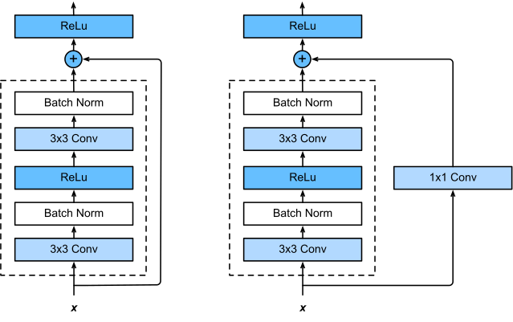
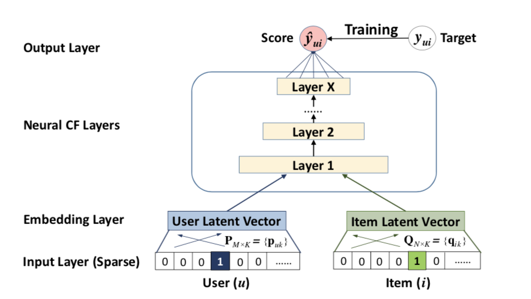

# Neural Font Embedder and Recommender

## Neural Font Embedder

A Convolutional [ResNet](https://arxiv.org/abs/1512.03385) AutoEncoder is used to obtain Font Embeddings.  
The ResNet architecture is as follows:

## Neural Collaborative Filtering Recommender System

Architecture:

Reference: [Recommender Systems using Deep Learning in PyTorch from scratch](https://towardsdatascience.com/recommender-systems-using-deep-learning-in-pytorch-from-scratch-f661b8f391d7)
